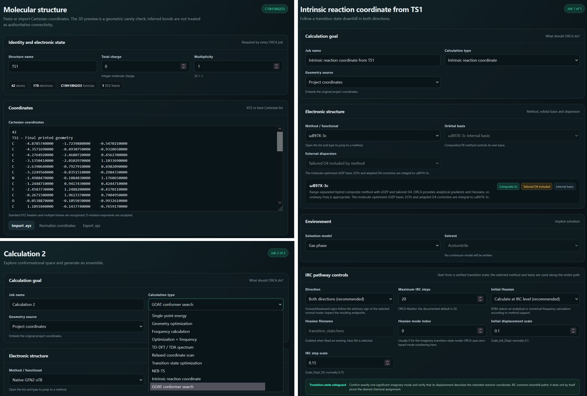
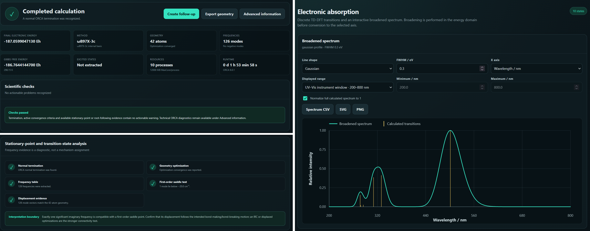

<!-- Optional header image:

-->

Computational chemistry has no shortage of powerful software. It does, however, have a shortage of interfaces that make routine work less tedious without hiding what is actually being calculated. RYBA began as my attempt to build a clearer input generator for the ORCA quantum-chemistry package. It has since grown into a standalone workspace for preparing calculations, inspecting their results and turning them into useful figures.

The current version, RYBA 1.14.0, still runs locally as a single HTML file. It requires no installation or internet connection, and molecular coordinates do not leave the computer.

**What can RYBA do?**

The Input Builder prepares common ORCA calculations, including optimizations, frequencies, TD-DFT, scans, transition-state searches, NEB-TS, GOAT and IRC pathways. Jobs can be combined into workflows, saved as projects and reused as templates. More importantly, RYBA checks combinations of methods, basis sets, approximations, solvents and numerical settings before the input is exported. The intention is not to replace scientific judgement, but to catch avoidable technical mistakes early.

The Results Analyzer reads ORCA outputs and separates complex calculations into a clear timeline. Extracted energies, geometries, frequencies and excited states retain links to their original output lines, so it is possible to see where each reported value came from. The reader also handles methods that are not present in RYBA's own input catalogue instead of simply displaying an unknown functional.

Calculated structures can be inspected in an interactive molecular viewer, measured using distances, angles and dihedrals, and exported as publication-ready SVG or PNG images. The latest renderer uses shared atom-and-bond depth ordering, giving molecular figures a more convincing three-dimensional appearance. Vibrational modes can be animated directly, while a transition-state summary helps identify significant imaginary frequencies and the atoms involved in the corresponding motion.

One of the most useful additions is the reaction thermochemistry assistant. Several calculated structures can be arranged into a reaction pathway, assigned as reactants, intermediates, transition states or products, and compared using electronic energies, ZPE-corrected energies, enthalpies or Gibbs energies. RYBA calculates relative energies and barriers and creates configurable reaction-profile diagrams, optionally including ball-and-stick structures. Safeguards flag differences in atom composition, charge, method, basis set, solvent, temperature and stationary-point character before a misleading graph is exported.

[**If you are interested in this project, you can download it here.**](../assets/projects/RYBA/RYBA_1.14.0.html)

Where could it go next?

The next major step should be multi-calculation comparison: placing methods, energies, structures, RMSD values, conformers and spectra into one consistent workspace. This would make it much easier to compare computational protocols or follow a molecule across several calculations.

Dedicated explorers for relaxed scans, IRC, NEB and GOAT are another natural direction. Instead of merely extracting a final number, RYBA could connect each point on an energy curve with its corresponding geometry and allow the complete pathway or conformational ensemble to be inspected interactively.

Finally, I would like RYBA projects to become genuinely reproducible computational notebooks. A saved project could contain the inputs, selected outputs, assumptions, provenance, notes and figures, and then generate a compact scientific HTML or PDF report. Such a report would make it easier to archive a calculation, share it with collaborators and later reconstruct exactly how a result was obtained.

RYBA remains very much a developing project, shaped by calculations that are useful in real research rather than by an ambition to reproduce every option in the ORCA manual. The long-term aim is simple: make computational work easier to prepare, easier to inspect and considerably harder to misunderstand.

**Examples from the input generator section of RYBA program.**

**Examples from the output analyzer  of RYBA .**

