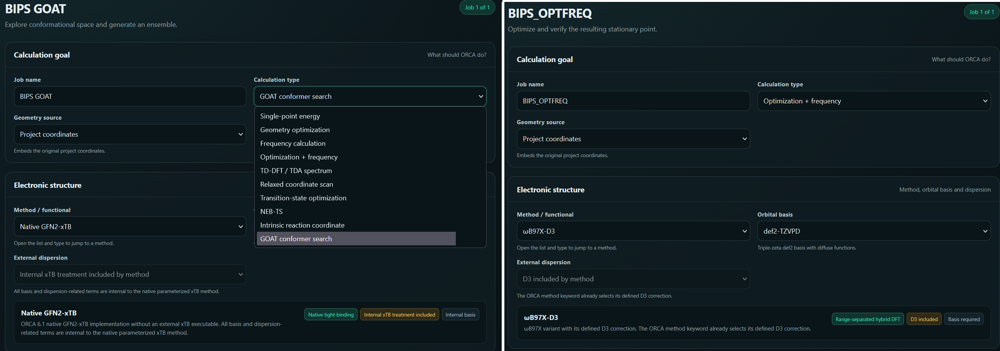
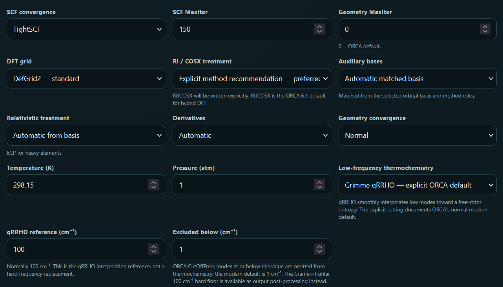
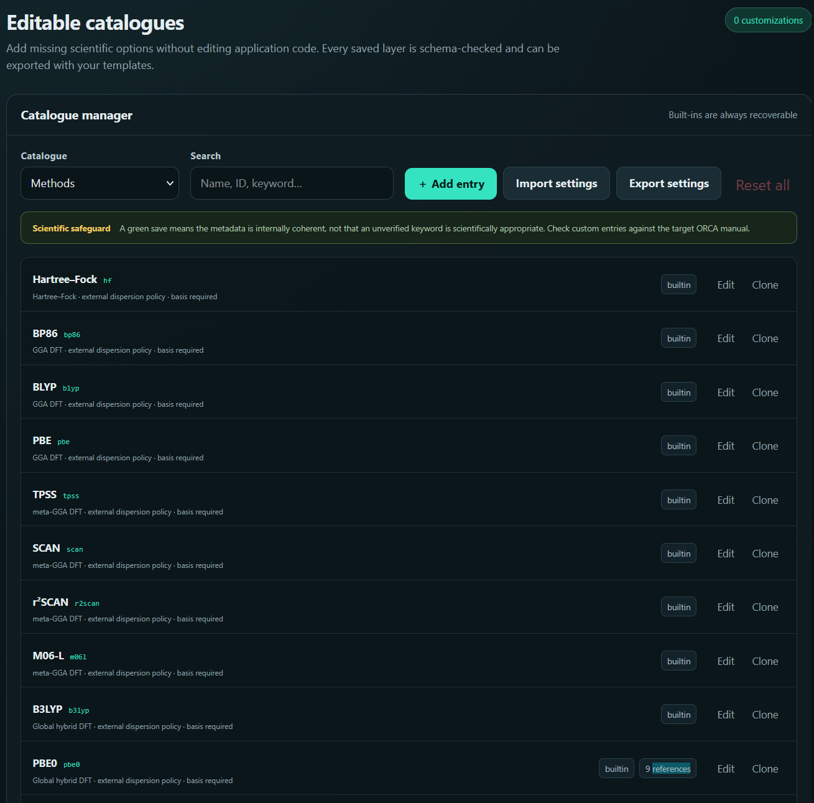
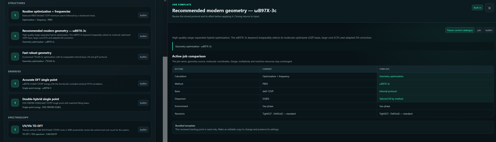

In the last [**post**](https://nevesely.science/2026-09-04-RYBA_introduction) RYBA as a suite for generating ORCA inputs and processing outputs was discussed. In this text I will show you a few concrete use cases of RYBA.

The philosophy of RYBA for input generation is simple and starts with an XYZ coordinates of your molecule of interest. So far RYBA doesn't have a dedicated drawing function and can only used XYZ coordinates obtained from previous calculations or you need to draw the image in different software like [**Avogadro**](https://avogadro.cc/index.html) (this is official website or its mutation specifically modified for use with ORCA from the official [**ORCA forum**](https://orcaforum.kofo.mpg.de/)  or my favourite [**Chemcraft**](https://chemcraftprog.com/index.html).

***The main screen of the RYBA input generator suite allows for the input of coordinates, either manual or using already existing XYZ file. Coordinates can also be reused from output files while extracting their results.***

Naturally, RYBA contains a plethora of  different jobs and methods which can be selected using simple dropdown menus. The job types available reach from simple optimizations, through excited states and transition state search to GOAT conformer analysis and relaxed scans. RYBA also allows for creation of input files with compound jobs chaining multiple processes into one input file. A typical use case of this feature for me is an optimization with frequency calculation and subsequent TD-DFT to obtain absorption spectras of the examined species. RYBA also contains checks and controls to tell user whether their methods already contains dispersion correction and thus additional keywords in this regards should be avoided. The same principle applies for basis set and composite methods. Overall there are most of the common methods present ranging from pure DFT functionals to double hybrids and several post-HF methods. Among the basis set there are predominantly Karlsruhe type and then a few special ones. 

***Selection of job type or method is as easy as clicking a dropdown menu.***

Other parameters for the calculations can be set bellow. Ranging from convergence type to approximations used to speed up the calculations. Again, the program includes checks to make sure correct approximations are applied to different types of functionals.

***Selection of additional settings for calculations.***

However, even if your favourite method or basis set is missing, it can be defined within the program and not just added as a one-time keyword!

***Method catalogue used to add new methods and define their properties.***

In case you have a routine set of job types and methods used you can generate templates (or select one of the pre-existing ones) in order to speed up your input file creation. In that case you only need to add appropriate XYZ coordinates and everything else is handled by the template of your choice.

***You can create your own templates to speed up the routine.***

