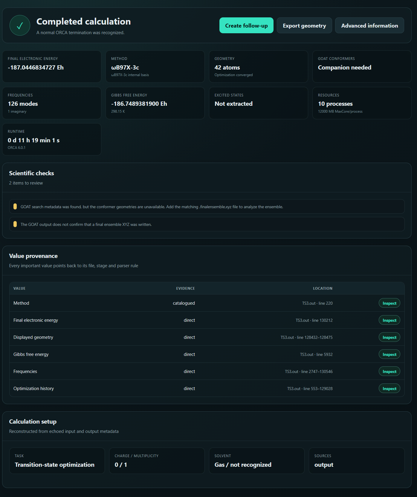
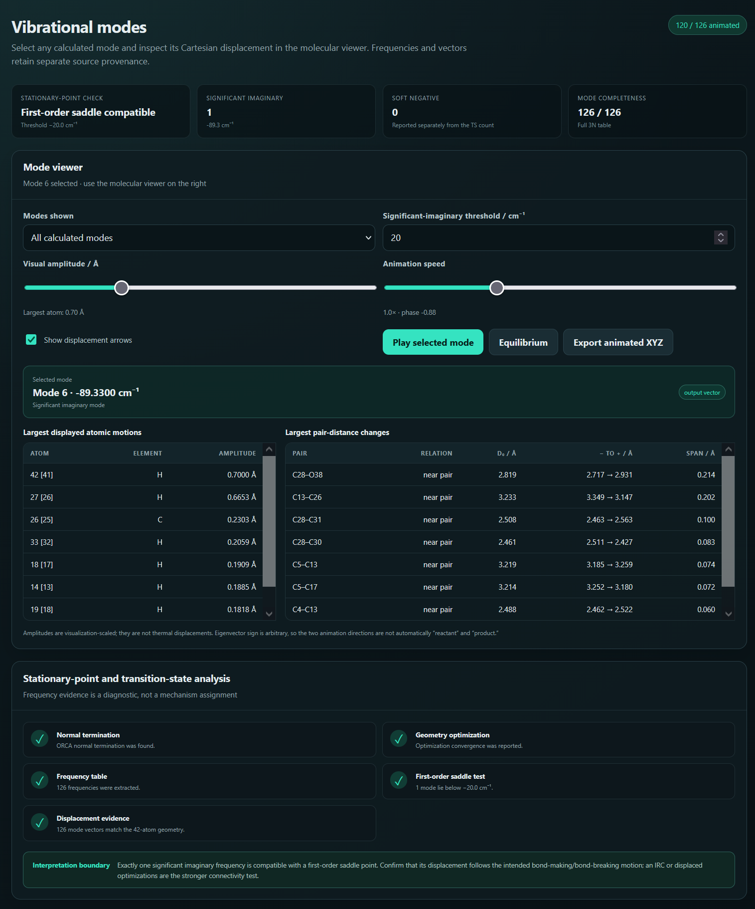
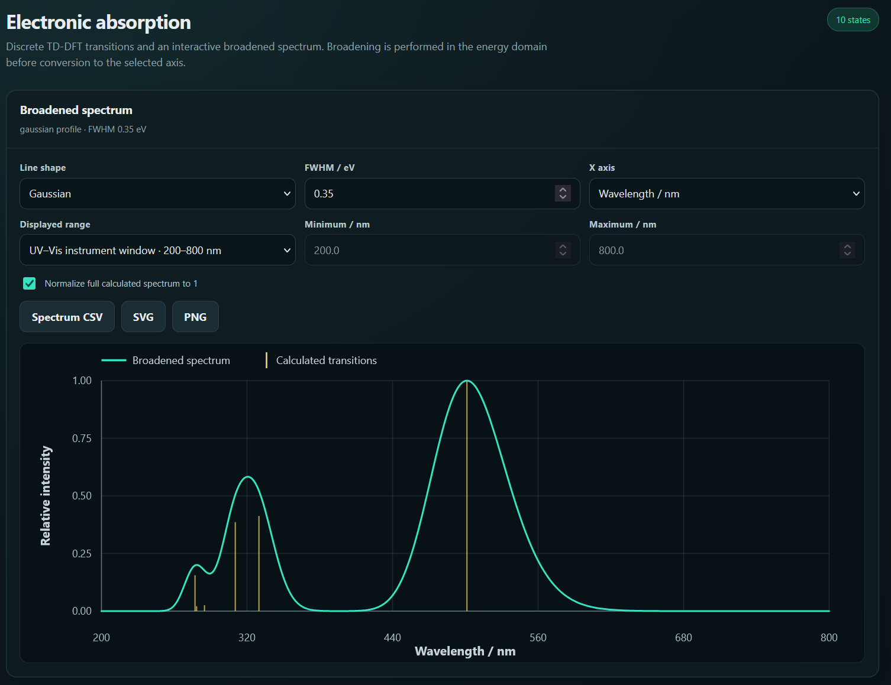
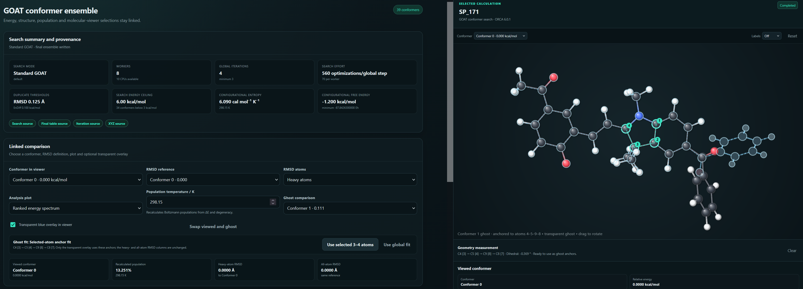
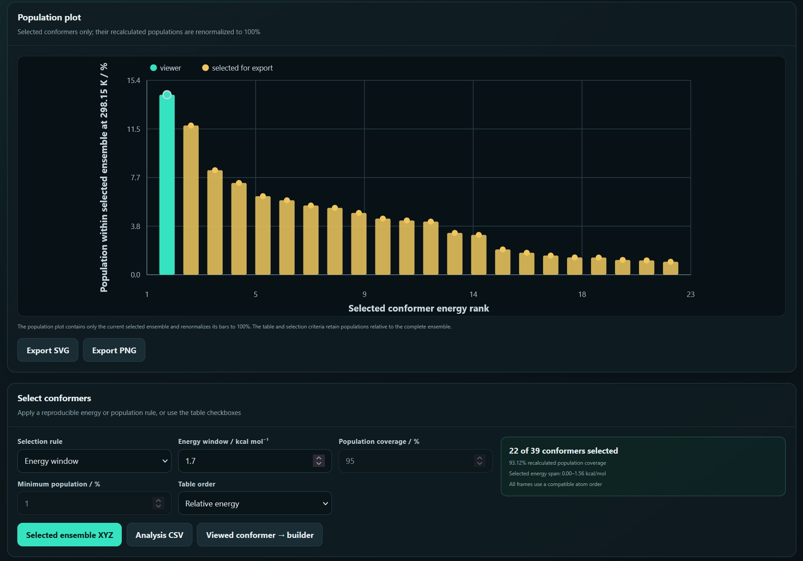
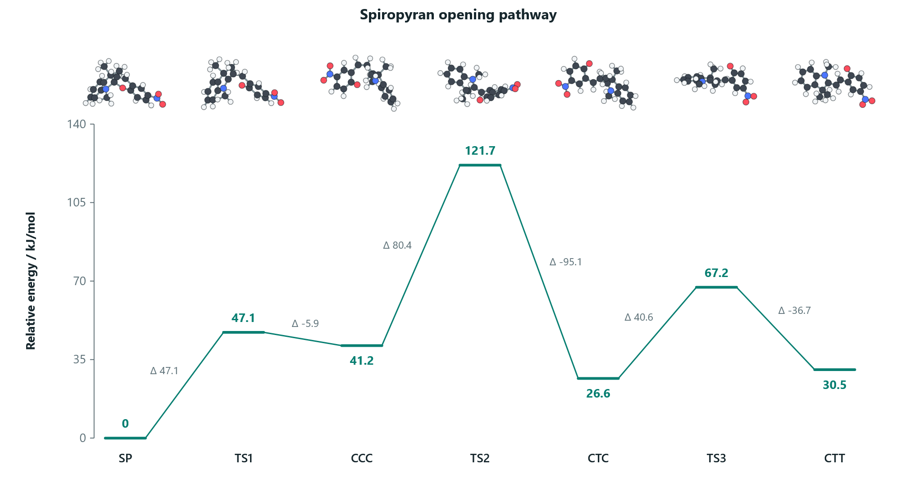
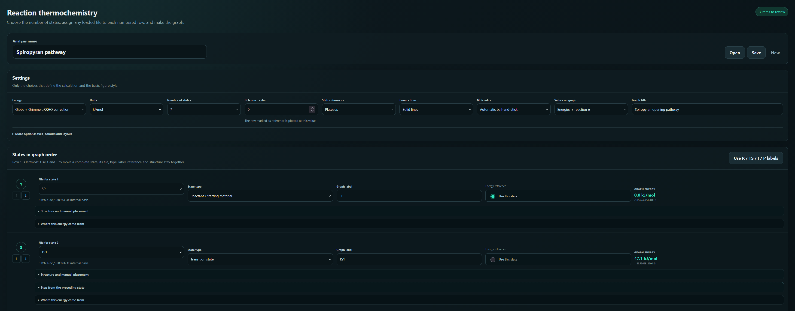
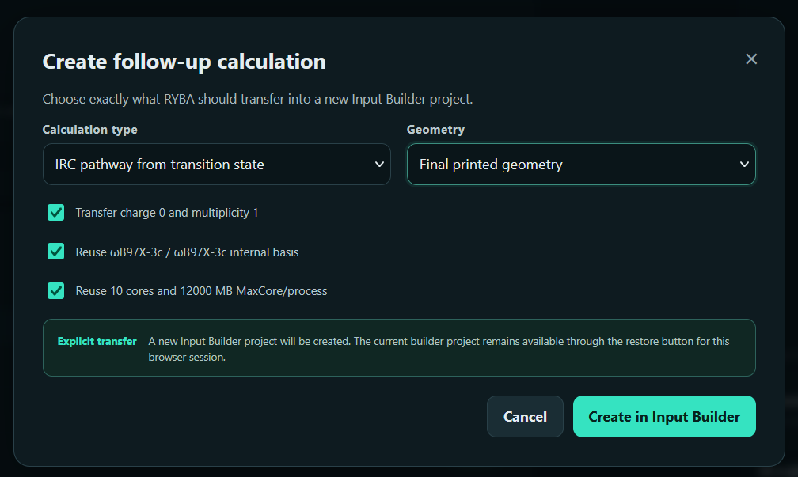

After the introduction of [**RYBA**](https://nevesely.science/2026-09-04-RYBA_introduction) software, and its use cases for [**creation**](https://nevesely.science/2026-09-04-RYBA_introduction) of ORCA input files, it is now time to speak about what RYBA can do four processing of your outputs from ORCA. 

Since this software was originally intended as a teaching tool for beginners untouched by calculations, there is a plethora of tests and checks which verify the normal termination of the calculations and try to give hints what some results could mean. An example of these hints will be shown further. Upon loading a new file user will get an overview of what type of job was performed, what method and basis set was used as well as the basic parameters such as energies. At the same time a window with the resulting molecule is available and allows user to measure distances, angles and dihedrals between the appropriate amount of selected atoms.

***The overview window shows the basic parameters of the calculation as well as if any problems were encountered such as unexpected termination of the calculation.***

RYBA can also display vibrational modes and animate them with all the usual parameters like amplitude and speed. Additional feature includes a hint about what the showed result could represent. In case of a single negative frequency it suggest that a transition state was found and to confirm the correct transition, IRC calculation should follow and can immediately create the input file with corresponding parameters. For small frequencies it suggest reoptimisation, etc. 

***Besides simply showing vibrational modes, RYBA can also provide a hint about the meaning of the results.***

Other useful feature is calculation of electronic transitions. RYBA can open files with TDDFT calculations and model absorption spectra using line broadening. It is also possible to save the image of the spectra for further use. This tool is so far very simple but addition of new features is planned.

***Visualization of absorption spectrum in RYBA.***

My favourite feature in RYBA which I was missing in other software is processing of GOAT files where RYBA allows for analysis of GOAT conformer calculations. It can show all the conformers obtained within the file, show their energies, relative differences and so on. But user can also select two particular conformers, select a fixed group of atoms for both conformers and overlay them in a ghost view. This functions allows for extremely easy comparation of two conformers and which particular parts of them differ. See the image bellow on the right side. 

***Analysis of conformers from GOAT calculations allow for easy comparison of two conformers by fixing several atoms and seeing where the rest differs.***

Apart from geometrical conformer comparison, population analysis have never been easier with GOAT toolbox in RYBA. Simply select the desired parameters like energy cut off and see the relative population of the residual conformers.

***Analysis of populations obtained from GOAT calculations.***

Last big feature allows user to analyze multiple calculation related to the same reaction and obtain energy diagram. Again, the safeguards within the program check whether the same method was used for all of them and whether all calculations contain the same elemental composition. There are multiple customization option available. As well as different type of energies to be compared.

***Example of energetic diagram built by RYBA.***

Each output file allows for continuing further calculations with the geometries obtained within the file. Typical use case being: user opens output file for transition state search job, selects the optimal geometry and submits frequency analysis job. Or any other combination like optimization+TDDFT.

***RYBA allows for a quick follow-up input files creation.***

