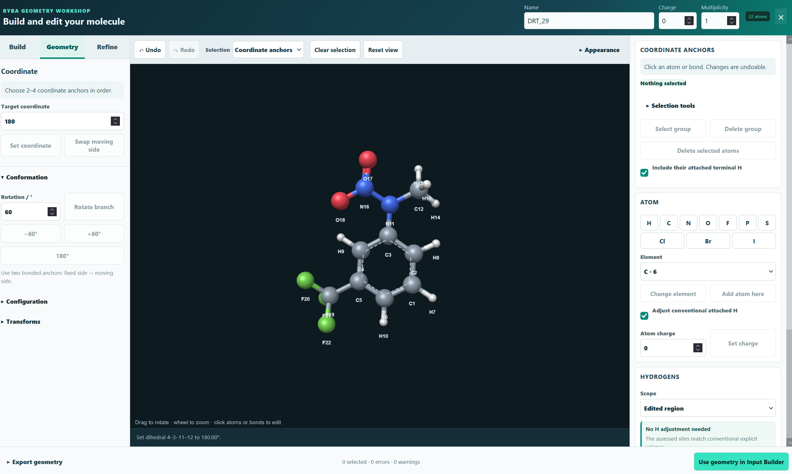
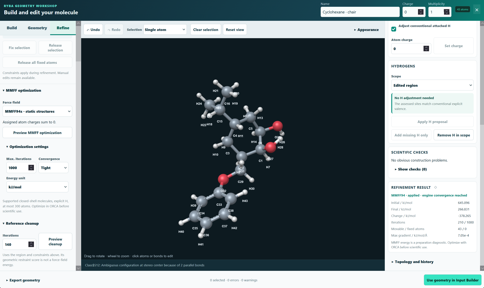

*You can find more about [**RYBA**](https://nevesely.science/2026-09-04-RYBA_introduction) software here.*

[**The program itself can be found on the download page.**](../downloads/)

RYBA can finally draw molecules! One of the thing missing in RYBA for a long time was a dedicated tool for drawing molecules. Till now the typical workflow would involve either reusing xyz files or geometries from finished calculations or using a dedicated program such as Avogadro. That is no longer neccessary as RYBA contains molecular workshop allowing you to draw molecules from scratch or modify existing ones!
When new molecule is to be created, you can select from a plethora of predefined scaffold such as benzene ring, heteroaromatic compounds or a humble alkyl chain of your desired lenghth. The molecular workshop allows for ataching or modyfing individual atoms but it also contains a list of common funtional groups which can be attached to an atom or replace it in a similar fashion.

And it is not just a basic drawing tool. It has several nice features. The most important being implemented force field (MMFF94) for optimization of drawed molecules and thus shortening your actuall optimization run in ORCA. Besides that, the workshop can verify basic features like missmatch between spin and the molecular composition or overlaping atoms. 

