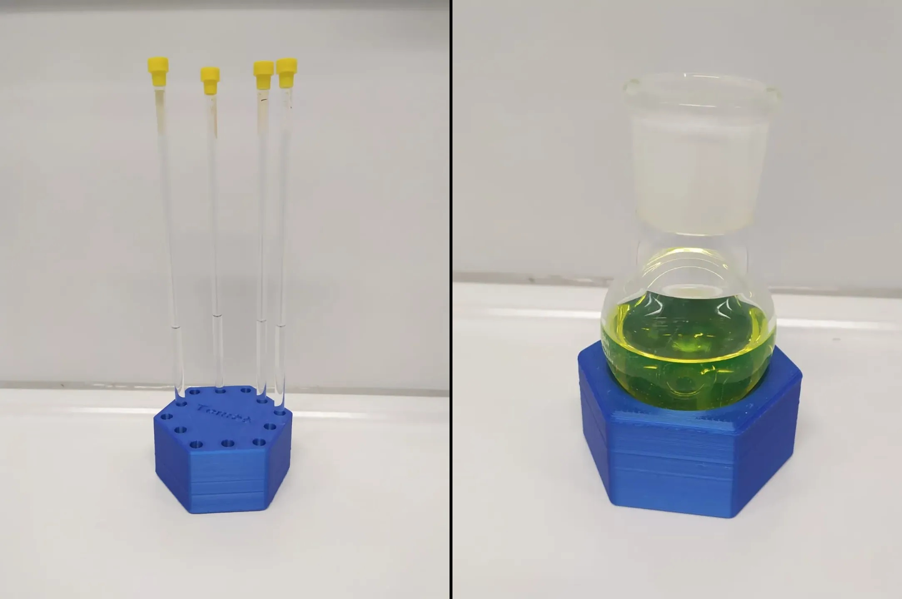

### Tools and devices (mostly 3D printed)

<strong>Small modular photoreactor</strong>

I was always curious about the photoreactors used in the field especially so when it was made in house and tailored for specific research needs. There are plenty of creative and robust solution out there. Anything from water cooled block from machined aluminium, to carousel style systems or just a simple array with a grid for tubes. There are also solutions which should have been never created in the first place. Still to this day when I see a Kessil lamp randomly aiming at a flask or a vial while wasting about 97 % of photons I have a mild allergic reaction... Oh and there obviously needs to be a desk fan cooling the setup.

I decided to make my own design. The biggest contributing factor being the speed (slowness) with which were the photoreactors build at the workshop of the university I was working at the time. Also, the reactors made by this workshop were rather primitive, a big hunk of aluminium with a few holes for flasks and LEDs at the bottom. Cooling was only passive and the temperature of the block equilibrated at about 50 °C. With this in mind, I decided to make design follow several principles. Simple and modular construction with the option to use multiple reaction vessels (mainly vials). The vials (or other vessel) should have always the same distance and angle from the irradiation source - this is absolutely crucial for reproducibility and it is still mind boggling how many top research groups do not care for this. The reactor should be air cooled. The power of the LED needs to be easily regulatable.

I designed the reactor to use 4 star LED modules which are attached using heat conductive double sided tape on an aluminium heatsink. The modules used were typically around 1 W each, but the heatsink in the combination with a small fan could probably handle at least 2x or 3x as much. The cooling is provided by a bottom mounted fan

**BOM:**  
3D printed parts (Download the files [here](../assets/files/Photoreactor_STL.rar)!)  
60 mm fan (12 or 24 V, depending on the power supply)
4 x M4*30 mm screw  
4 x LED module (star)  
Aluminium heatsink (43 mm or 50 mm)  
Buck converter (for example XL4015 based)  
Power adapter 12 - 24 V (Even old laptop charger or similar will be sufficient)
Double sided tape - heat conductive  
Some wire and a soldering iron  

**Instructions**
The most important part is to attach LEDS symmetrically so all the vials are getting the same amount of light. In my case I put the LEDs in a way that the actual light emitting parts were on a square with a side length of 24 mm or in the case of my 43 mm heatsink, the LED modules in the example bellow were 5mm of the edge of the heatsink. Afterwards, everything needs to be soldered. Typically, there cheap buck converters will be current limited, therefore solder the LEDs in series Or two in series and make parallel pairs. The total current must be lower than the limit of the buck converter and just as well the required voltage must be lower than what the power supply can provide. Measure the current and set the potentiometer to an appropriate value. The screws in this build act as a standoff for the fan to provide cooling of the LEDs and the air flow through the reactor is sufficient enough to cool the reaction vessels as well. The fan can be connected in front of the buck convertor, directly to the power supply.

<strong>Stand for NMR tubes</strong>

This stand was designed to hold 12 NMR tubes (5 mm diameter) and if turned upside down it can hold a flask. It is useful for round bottom or pear-shaped flask of volumes from 10 to 100 mL. The top part can be used to imprint some text like name as you can see from included photos. (Download the STL file [here](../assets/files/NMRStand/Stand.stl)!)  
It wroks well if its printed from PLA, but I would recommend TPU for extra grip. Especially if you would like to use it to hold flasks as well. However, these materials are not particularly solvent resistant and if you wish to have a stand resiliant even to the clumsier of hands, print it from PP filament.
 [You can also find this stand on Printables](https://www.printables.com/model/211174-nmr-tubes-stand-with-a-place-for-flask)

### Software related tools

<strong>RybaGUI — ORCA input generator</strong>

...

### Teaching and mentoring

<strong>Quantum chemistry teaching material</strong>

...

D 
3
